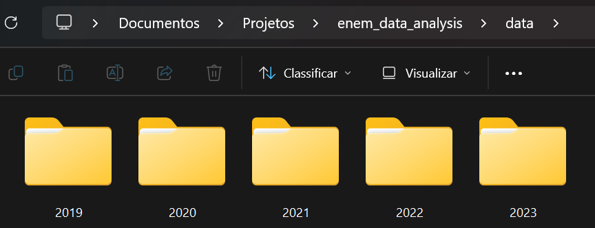
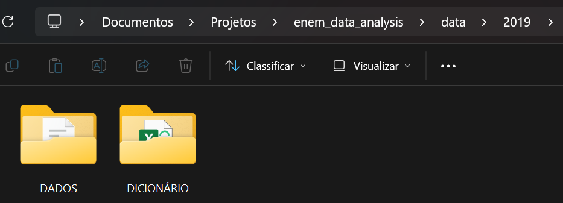

# Análise de Dados do ENEM (Exame Nacional do Ensino Médio)
## Em desenvolvimento🤓👩‍💻

## Objetivo Principal
Criar um painel interativo com as informações do ENEM no período de 2019 a 2023, a fim de extrair insights valiosos sobre os inscritos na prova, resultados obtidos no exame e questões socioeconômicas dos participantes.

**Escolha de período**: devido ao grande volume de dados, limitei aos dados dos últimos 5 anos que constam no site oficial. De certo modo, esse intervalo é super interessado para ser analisado, dado que envolve um ano pré-pandemia (2019), pandemia (2020-2021), pós-pandemia (>2022) e é possível ver mudanças bem relevantes, principalmente de 2020 em comparação aos anos posteriores. 

## Descrição
Este projeto é uma análise de dados que utiliza exclusivamente **Power BI** para tratar, analisar e visualizar dados. A fim de aprimorar o uso completo da ferramenta, no que se refere ao Power Query, DAX (Data Analysis Expressions) e ao próprio dashboard, optei por seu uso exclusivo. 
Durante a descrição do projeto, pontuarei vantagens e desvantagens em realizar todo o tratamento de dados via Power Query.

## Conjunto de Dados
O conjunto de dados escolhido pode ser acessado no site oficial do gov: [Microdados Enem](https://www.gov.br/inep/pt-br/acesso-a-informacao/dados-abertos/microdados/enem?utm_source=chatgpt.com). 
Veja que os microdados são separados por ano, e ao baixar a pasta completa, haverá subpastas. Para o projeto, usa-se `DADOS` e `DICIONÁRIO`.

Para tal, usa-se dois conjuntos de dados, que constam para todos os anos no mesmo formato e padrão.
- `MICRODADOS_ENEM_ANO`: Contém a base geral de informações dos inscritos, resultados da prova e questões socioeconômicas.
- `ITENS_PROVA_ANO`: Contém informações básicas de entendimento sobre os itens da prova por área do conhecimento.

## O que este projeto faz
- Trata, limpa os dados e cria novas colunas usando o **Power Query**.
- Cria novas medidas usando o **DAX**.
- Cria dashboard interativo com **Power BI**.

## Ferramenta Utilizada
- **Power BI**: Tratamento de dados (ETL), DAX e criação do dashboard.

## Estrutura do Repositório
- **data/**: Dados brutos advindos do site oficial do gov. Contém subpastas, também originais.
Como essa pasta ultrapassa o limite de armazenamento permitido pelo Github, confira as imagens abaixo, para conseguir visualizar a estrutura. Novamente, essas pastas são as originais, sem nenhuma modificação.👇

- **bi/**: Dashboard do Power BI e templates usados.
  - **templates/**: Contém os arquivos .svg referentes aos templates usados nas páginas do dashboard. Cada um está nomeado conforme o uso. 
  - **dashboard_images**: Contém os arquivos .png referentes a cada página do dashboard. Para ver a demonstração de uso, vá até a seção [Vídeos de Demonstração](#Vídeos de Demonstração).

- **structure_images**: Contém imagens para serem usadas no README.md, a fim de facilitar o entendimento da estrutura do projeto.
 
## Considerações
### A finalizar

## Vídeos de Demonstração
### Power Query

### Página 1 - Dados dos Inscritos

### Página 2 - Prova Objetiva e Redação

### Página 3 - Questionário Socioeconômico

### Página 4 - Itens da Prova

## Contato 
Se quiser dar um feedback, sugestões de melhorias, tirar uma dúvida ou simplesmente conversar sobre o mundo de Análise de Dados, sinta-se a vontade para entrar em contato comigo:
📩 larasrodrigues19@gmail.com 